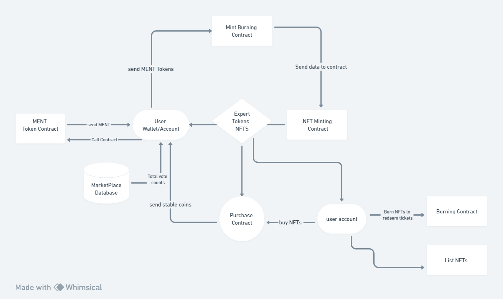
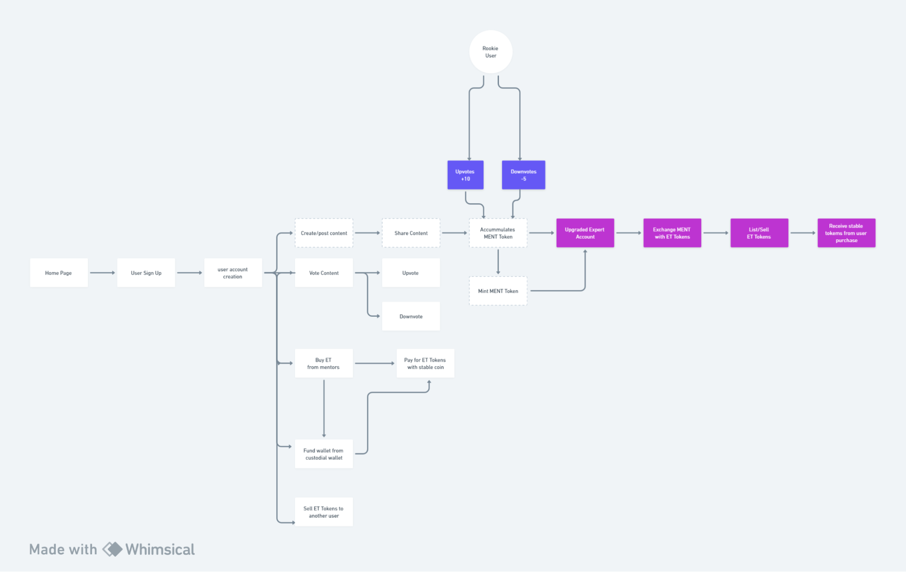

# **Expert Mentor MarketPlace**

## **About Project**

The Expert mentor platform is a decentralized mentoring protocol built with public blockchains. The Mentor Marketplace enables experienced professionals to give back to society by hosting mentorship classes for early and mid-level professionals in a rewarding system. The protocol includes:

1. Mentor Token - MENTOR or MENT
2. Expert Token- EXPT

All these together creates a symbiotic protocol that is mutually beneficial to all stakeholders.

## **Token Model**

The EM Protocol is made up of various stakeholders with different goals; to achieve a self-sustaining network, each stakeholder must have aligned incentives

#### **Community Member (Rookie)**

* Anyone who signs up to the platform.
* Anyone who upvotes, downvotes, comments on content
* They can request to be mentored by a mentor that they admire.
* Pay for Mentor Tickets MT with a stablecoin.
* Exchange Expert Tokens for session time with Mentors 
* Trade the ETs to other community members in the MT Marketplace

#### **Expert (or Mentor)**

* A community member who has earned Expert status by contributing content and can sell MTs for one-on-one or group mentoring sessions
* When content is shared by a Mentor, the community can choose to upvote or downvote content, which allows Mentor tokens to be rewarded or burnt. The earned MENT will be released after a certain threshold is reached to the mentors.
* Earn fees from sale of their EXPTs.

## **Introducing the Mentor Token (MENT)**

We introduce to you MENTOR, a utility token that drives the backbone of our learning platform. Every MENT token is assigned governance weight and helps share any future decision made on the platform. MENTOR (MENT) has the following functionality:

* Reward for sharing expertise with community
* Penalises bad actors
* An indicator of expertise to community members
* Governance for community decisions (TBD)
* Mentors are awarded(mint) or deducted(burnt) MENT Based on the cumulative upvotes or downvotes,
* When the balance of MENT crosses a threshold for any community member, they become an “Mentor” recognized by the community

#### **Token Properties**

<table>
  <tr>
   <td>
   </td>
   <td><strong>Properties </strong>
   </td>
   <td><strong>Attributes </strong>
   </td>
  </tr>
  <tr>
   <td>1
   </td>
   <td>Type 
   </td>
   <td>Fungible Tokens
   </td>
  </tr>
  <tr>
   <td>2
   </td>
   <td>Maximum Supply 
   </td>
   <td>Infinite 
   </td>
  </tr>
  <tr>
   <td>3
   </td>
   <td>Number of Decimals 
   </td>
   <td>zero
   </td>
  </tr>
  <tr>
   <td>4
   </td>
   <td>Functionality 
   </td>
   <td>Utility, Social reputation token
   </td>
  </tr>
  <tr>
   <td>5
   </td>
   <td>Utility 
   </td>
   <td>Upvote, downvote, comment 
   </td>
  </tr>
  <tr>
   <td>6
   </td>
   <td>Restrictions
   </td>
   <td>Non-transferable, non tradeable
   </td>
  </tr>
</table>

### **MENT Token Utility**

#### **Grading Published Content**

* Publish content
* Community reads it AND upvotes or downvotes based on their impression of the content
* Based on the cumulative upvotes or downvotes, they get rewarded with MENT or their MENT is burnt

#### **Upvoting Content**

* Any user can upvote a content they find educating, insightful or useful 
* Each upvote cost 10 MENT Tokens (1 upvote = 10 MENT Tokens)

#### **Downvoting Content**

* Any user can downvote a content they find untrue, unhelpful or difficult to understand 
* Each downvote cost 5 MENT Tokens (1 downvote = 5 MENT tokens)

#### **Become a Mentor**

* When the balance of MENT crosses a threshold for any community member, they become an “Mentor” recognized by the community
* For each threshold completed, they can mint Expert Token reward while they keep creating content
* A new capability at that point is to sell limited slots to community members for one-on-one or group mentorship sessions with the expert tokens 
* An Expert lists the Expert Token (EXPT)  in the marketplace for all Community Members
* Experts are in tiers, making it hard to attain expert status  may not need money as an incentive but they may have other jobs that they require people to do for them, in this case.

To reach a level, a Mentor’s accumulated votes from all their contents must be equal to or above the tier’s requirement

<table>
  <tr>
   <td>
   </td>
   <td><strong>TIERS</strong>
   </td>
   <td><strong>MENTOR TOKENS</strong>
   </td>
   <td><strong>Expert Token Reward</strong>
   </td>
  </tr>
  <tr>
   <td>Level 1
   </td>
   <td>Apprentice 
   </td>
   <td>1000
   </td>
   <td>50 Tickets 
   </td>
  </tr>
  <tr>
   <td>Level 2
   </td>
   <td>Protege
   </td>
   <td>3000
   </td>
   <td>100  tickets
   </td>
  </tr>
  <tr>
   <td>Level 3
   </td>
   <td>Expert 
   </td>
   <td>5000
   </td>
   <td>200 tickets
   </td>
  </tr>
</table>

## **Introducing the Expert Token (EXPT)**

For a network to sustain itself all stakeholders must earn a reward consummate with the value they bring to the network, Expert token is what makes content creation beneficial to mentors. The more quality content mentors create, the more tokens they earn. Tokens earned are accumulated and then redeemed for expert tickets. The EXPT Token have the following functionality; 

* Reward for reaching a threshold of Mentor Tokens 
* Creates an NFT collection for a mentor
* Can be sold by Mentors in EM Marketplace 
* Gives holders access to group calls & one on one mentorship sessions

### **EXPT Token Utility**

#### **Group Mentorship Sessions**

* Gives access to the Mentor Community 
* Every holder of a Mentor

#### **One-on-One mentorship sessions**

* To get access to a mentor via the platform, they’ll have to buy a Expert Mentor NFT
*  EXPT Tokens are transferable and is a full commodity that can be sold in a marketplace
* Redemption of this token means that a community member has had the session with the Expert, it’ll burned after and can’t be redeemed, transferred or sold again
* Expert Tokens can be bought with an approved stablecoin or crypto (e.g USDT, USDC, etc)

#### **Expert Token (EXPT)  Marketplace**

* This is where Expert Tokens (which is access to a mentor) are bought & sold. 
* Any one can buy an EXPT from mentors for a specific amount & redeem it through Mentorship
* A community member can list EXPT Tokens bought for secondary sale to other users
* Mentors can list **EXPT Tokens** themselves based on their preferences, prices, etc
* Mentors do not pay listing fees as they have earned it by exchanging MENT Token for it
* To list **EXPT Token** as a community member, you must have sufficient MENT and also  pay listing fees either on listing or when a sale has been completed

### **Issuance Mechanism (MENT)**

* MENTOR (MENT) tokens are earned by community members  for contributing content and providing mentorship.
* MENT tokens are minted as rewards for sharing expertise and can be burnt as a penalty for poor content,
* MENT tokens are non-transferrable and are used to indicate expertise within the community.
* Expert Token are rewards given to Mentors for completing a threshold of expertise in the community. 
* Mentor Tokens can list EXPT Tokens for community members for purchase 
* When purchased, Users exchange EXPT Tokens for Mentorship sessions, and Tokens are burned from the system

### **Actors, Incentives & Behaviours**

The right behaviours are required to make a network self-sustaining, therefore every right behaviour by an actor should be rewarded with an incentive that drives the behaviour even further 

<table>
  <tr>
   <td><strong>Actors</strong>
   </td>
   <td><strong>Behaviours </strong>
   </td>
   <td><strong>Incentives </strong>
   </td>
   <td><strong>Reward</strong>
   </td>
  </tr>
  <tr>
   <td>Community member 
   </td>
   <td>Votes content 
   </td>
   <td>Build visibility 
   </td>
   <td>
   </td>
  </tr>
  <tr>
   <td>
   </td>
   <td>Write quality content 
   </td>
   <td>Gain MENT Tokens
   </td>
   <td>Gain Apprentice Status
   </td>
  </tr>
  <tr>
   <td>
   </td>
   <td>Buy EXPT tickets
   </td>
   <td>Join Mentor Community
   </td>
   <td>Mentorship sessions

career clarity 
   </td>
  </tr>
  <tr>
   <td>Apprentice
   </td>
   <td>Write more quality content
   </td>
   <td>1000+ MENT Tokens 
   </td>
   <td>Gain Protege Status 
   </td>
  </tr>
  <tr>
   <td>Protege
   </td>
   <td>Write quality content
   </td>
   <td>Gain Expert Status 
   </td>
   <td>
   </td>
  </tr>
  <tr>
   <td>
   </td>
   <td>Promote/Sell EXPT Tokens
   </td>
   <td>Receive crypto payment
   </td>
   <td>Financial (Make money)  \
Give back fulfilment
   </td>
  </tr>
  <tr>
   <td>Expert
   </td>
   <td>Write quality content
   </td>
   <td>Participate in Governance decision
   </td>
   <td>Set EXPT pricing
   </td>
  </tr>
</table>

#### **Token User Flow**

This token design flow highlights the relationship between the token contracts, user wallets, and the platform utilities. It also highlights the movement of the token from one stage to another.

**[Token Flow Link](https://whimsical.com/ment-token-flow-UJHQ62yCUsnxXRiFBAv3s1)**

**Platform User Flow**

**[User Flow Link](https://whimsical.com/expert-mentor-marketplace-user-flow-NBZ57fXGha5g9a5vzidV54)**

#### **Footnote:**

_Certain aspects of this tokenomics are yet to be determined, and are still being worked on; these sections are highlighted here as they require agreement by all stakeholders before we can move forward ._

_UX Experience_

* _Users do not need to have a crypto wallet_
* _Mentors should have a crypto wallet where their accumulated tokens_
* _Requirements for signing into the system should be easy & straightforward_

_Tokens_

* _since MENT Tokens are associated with social reputation, they would not be airdropped_
* _New ways of issuing them into the system should be determined_
* _The pricing of EXPT Tokens is yet to be determined (would it be set by network or mentor)_
* _On resale of EXPT, should royalties go to the Mentor who created the EXPT in the first place?_
* _The crypto currency to be used as a native trading currency is yet to be determined_
* _The amount of mentorship time granted to users for each NFT ticket is yet to be determined_
* _The amount of listing fees, mentors & users have to pay is yet to be determined_
